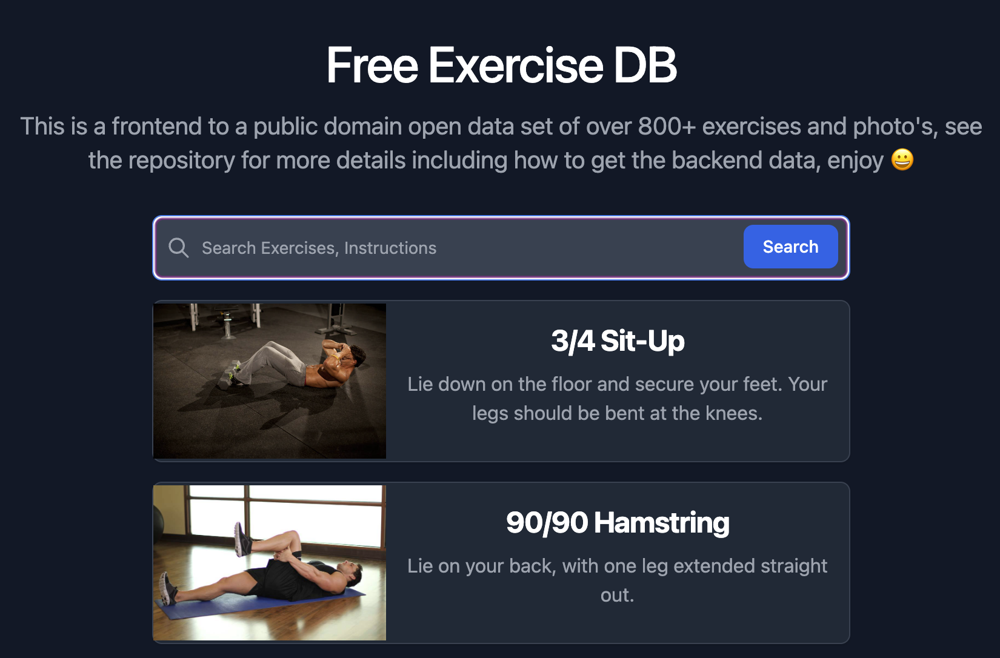

## Free Exercise DB 💪  &nbsp; [](https://github.com/yuhonas/free-exercise-db/actions/workflows/ci.yaml) [](http://unlicense.org/)

Open Public Domain Exercise Dataset in `JSON` format, 800+ exercises with a browsable public searchable frontend

### Why?

I started building another fitness related app and was looking for free/open source exercise lists and imagery I stumbled upon
[exercises.json](https://github.com/wrkout/exercises.json) which was amazing though the data wasn't structured the way I wanted it and I also wanted a browsable/searchable frontend to the data inspired by [this issue](https://github.com/wrkout/exercises.json/issues/5) so I restructured the data and built a simple frontend to it :)

### What do they look like?

All exercises are stored as seperate `JSON` documents and conform to the following [JSON Schema](./schema.json) eg.

```json
{
  "id": "Alternate_Incline_Dumbbell_Curl",
  "name": "Alternate Incline Dumbbell Curl",
  "force": "pull",
  "level": "beginner",
  "mechanic": "isolation",
  "equipment": "dumbbell",
  "primaryMuscles": [
    "biceps"
  ],
  "secondaryMuscles": [
    "forearms"
  ],
  "instructions": [
    "Sit down on an incline bench with a dumbbell in each hand being held at arms length. Tip: Keep the elbows close to the torso.This will be your starting position.",
  ],
  "category": "strength",
  "images": [
    "Alternate_Incline_Dumbbell_Curl/0.jpg",
    "Alternate_Incline_Dumbbell_Curl/1.jpg"
  ]
}
```
See [Alternate_Incline_Dumbbell_Curl.json](./exercises/Alternate_Incline_Dumbbell_Curl.json)

To further explore the data, you can use [lite.datasette.io](https://lite.datasette.io/?json=https://github.com/yuhonas/free-exercise-db/blob/main/dist/exercises.json#/data/exercises?_facet_array=primaryMuscles&_facet=force&_facet=level&_facet=equipment)

### How do I use them?

You can check the repo out and use the `JSON` files and images locally

#### Alternatively

You can leverage github's hosting and access the single or combined [exercises.json](https://raw.githubusercontent.com/yuhonas/free-exercise-db/main/dist/exercises.json) and prefix any of image path's contained in the `JSON` with `https://raw.githubusercontent.com/yuhonas/free-exercise-db/main/dist/exercises/` to get a hosted version of the image eg. [Air_Bike/0.jpg](https://raw.githubusercontent.com/yuhonas/free-exercise-db/main/exercises/Air_Bike/0.jpg) or leverage something like [imagekit.io](https://imagekit.io/) for dynamic image resizing which is utlized on the frontend [ example site ](https://github.com/yuhonas/free-exercise-db/blob/main/site/src/components/PhotoGallery.vue#L44-L54)

### Build tasks
There are a number of helpful [Makefile](./Makefile) tasks that you can utilize

#### Linting
To lint all the `JSON` files against the [schema.json](./schema.json) use

```
make lint
```

#### Combining into a single JSON file
If you make changes to any of the exercises or add new ones, to recombine all single `JSON` files into a single `JSON` containing an array of objects using the following make task

```sh
make dist/exercises.json
```
_Note: requires [jq](https://stedolan.github.io/jq/)_

#### Importing into PostgreSQL
To combine all `JSON` files into [Newline Delimeted JSON](http://ndjson.org/) suitable for import into PostgreSQL use the following make task

```sh
make dist/exercises.nd.json
```
_Note: requires [jq](https://stedolan.github.io/jq/)_

See also [Importing JSON into PostgreSQL using COPY](https://konbert.com/blog/import-json-into-postgres-using-copy)

### Browsable frontend



There is a simple searchable/browsable frontend to the data written in [Vue.js](https://vuejs.org/)  available at [yuhonas.github.io/free-exercise-db](https://yuhonas.github.io/free-exercise-db/) all related code is in the [site](./site) directory


#### Setup

```sh
npm install
```

#### Compile and Hot-Reload for Development

```sh
npm run dev
```

#### Compile and Minify for Production

```sh
npm run build
```

#### Run Unit Tests with [Vitest](https://vitest.dev/)

```sh
npm run test:unit
```

#### Run End-to-End Tests with [Cypress](https://www.cypress.io/)

```sh
npm run test:e2e:dev
```

This runs the end-to-end tests against the Vite development server.
It is much faster than the production build.

But it's still recommended to test the production build with `test:e2e` before deploying (e.g. in CI environments):

```sh
npm run build
npm run test:e2e
```

#### Lint with [ESLint](https://eslint.org/)

```sh
npm run lint
```

### TODO

#### Incomplete fields

The following fields are incomplete in _some_ `JSON` files and in such have had to allow `null` in [schema.json](./schema.json)

* force
* mechanic
* equipment

#### Images

There are also a small number of duplicate images eg.

```sh
jdupes --summarize --recurse .

Scanning: 2620 files, 874 items (in 1 specified)
25 duplicate files (in 22 sets), occupying 809 KB
```

### Contributors

<a href="https://github.com/yuhonas/free-exercise-db/graphs/contributors">
  
</a>

Made with [contrib.rocks](https://contrib.rocks).

Contributions are always welcome! Please read the contribution guidelines first.

### Special Thanks 🙇
* [Ollie Jennings](https://github.com/OllieJennings) for the original dataset at [exercises.json](https://github.com/wrkout/exercises.json)
* flaticon for the favicon see [Sports-and-competition icons created by Dragon Icons - Flaticon](https://www.flaticon.com/free-icons/sports-and-competition)
